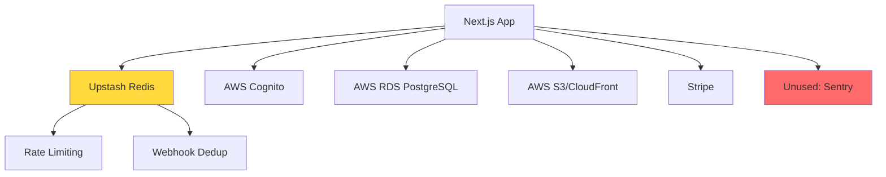
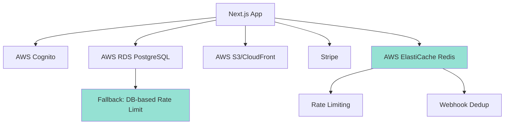

# Design Document: App Simplification

## Overview

This design consolidates QuiltCorgi to AWS-native services, removing 3rd party SaaS dependencies (Upstash Redis) and unnecessary complexity. The goal is a leaner, more maintainable codebase focused on core quilt design functionality with simplified social features. The architecture shifts from distributed Redis-based rate limiting to AWS ElastiCache or simpler database-backed solutions, eliminates unused generators and features, and streamlines the trust/social systems.

## Architecture

### Current State



### Target State



## Main Workflow: Dependency Audit & Migration

```mermaid
sequenceDiagram
    participant Dev as Developer
    participant Audit as Dependency Audit
    participant Redis as Redis Migration
    participant Features as Feature Removal
    participant DB as Database
    
    Dev->>Audit: Review package.json
    Audit->>Audit: Identify 3rd party services
    Audit-->>Dev: Upstash Redis (keep), Sentry (not present)
    
    Dev->>Redis: Migrate to AWS ElastiCache
    Redis->>Redis: Update connection config
    Redis->>Redis: Add fallback to DB
    Redis-->>Dev: Migration complete
    
    Dev->>Features: Remove unused features
    Features->>Features: Delete generators (Kaleidoscope, Frame)
    Features->>Features: Delete Photo Patchwork
    Features->>Features: Simplify trust system
    Features->>DB: Drop removed tables
    Features-->>Dev: Cleanup complete


## Components and Interfaces

### Component 1: Redis Migration Service

**Purpose**: Migrate from Upstash Redis to AWS ElastiCache with database fallback

**Interface**:
```typescript
interface RateLimitService {
  checkRateLimit(key: string, options: RateLimitOptions): Promise<RateLimitResult>;
  isDuplicate(eventId: string): Promise<boolean>;
}

interface RateLimitOptions {
  limit: number;
  windowMs: number;
}

interface RateLimitResult {
  allowed: boolean;
  remaining: number;
  retryAfterMs: number;
}

interface ElastiCacheConfig {
  host: string;
  port: number;
  password?: string;
  tls: boolean;
}
```

**Responsibilities**:
- Connect to AWS ElastiCache Redis cluster
- Provide rate limiting for API endpoints
- Handle webhook event deduplication
- Fallback to database-backed rate limiting when Redis unavailable
- Maintain backward compatibility with existing rate limit logic

### Component 2: Trust System Simplifier

**Purpose**: Replace 7-level trust hierarchy with 3-role system

**Interface**:
```typescript
type UserRole = 'free' | 'pro' | 'admin';

interface RolePermissions {
  canLike: boolean;
  canSave: boolean;
  canComment: boolean;
  canPost: boolean;
  canModerate: boolean;
}

interface TrustEngine {
  getRolePermissions(role: UserRole): RolePermissions;
  getRateLimit(role: UserRole, action: 'comments' | 'posts'): number;
}
```

**Responsibilities**:
- Map user roles to permissions
- Provide role-based rate limits
- Remove trust level calculations (account age, approval counts)
- Eliminate auto-moderation queue logic

### Component 3: Feature Cleanup Service

**Purpose**: Remove unused generators and features

**Interface**:
```typescript
interface FeatureCleanup {
  removeGenerators(generators: string[]): Promise<void>;
  removePhotoFeature(feature: 'patchwork' | 'pattern'): Promise<void>;
  removeSocialFeatures(features: string[]): Promise<void>;
}

interface CleanupResult {
  filesDeleted: number;
  linesRemoved: number;
  tablesDropped: string[];
}
```

**Responsibilities**:
- Delete Kaleidoscope and Frame generator files
- Remove Photo Patchwork (pixelation) feature
- Remove batch print functionality
- Remove design variations system
- Clean up follows, comment likes, and reports

### Component 4: Social System Simplifier

**Purpose**: Streamline social features to core functionality

**Interface**:
```typescript
interface SocialFeed {
  fetchDiscoverPosts(limit: number, offset: number): Promise<CommunityPost[]>;
  fetchSavedPosts(userId: string): Promise<CommunityPost[]>;
  fetchMostSaved(timeRange: 'month' | 'all-time', limit: number): Promise<CommunityPost[]>;
}

interface PostActions {
  likePost(postId: string, userId: string): Promise<void>;
  savePost(postId: string, userId: string): Promise<void>;
  commentOnPost(postId: string, userId: string, content: string): Promise<Comment>;
}
```

**Responsibilities**:
- Remove follows system
- Remove comment likes
- Remove content reporting
- Replace Featured with Saved tab
- Add Most Saved section with time filters

## Data Models

### Model 1: ElastiCache Connection

```typescript
interface ElastiCacheConnection {
  host: string;
  port: number;
  password: string | null;
  tls: boolean;
  connectionTimeout: number;
  commandTimeout: number;
}
```

**Validation Rules**:
- Host must be valid AWS ElastiCache endpoint or localhost
- Port must be between 1024 and 65535
- TLS required for production environments
- Timeouts must be positive integers

### Model 2: Simplified User Role

```typescript
interface UserWithRole {
  id: string;
  email: string;
  role: 'free' | 'pro' | 'admin';
  createdAt: Date;
  updatedAt: Date;
}
```

**Validation Rules**:
- Role must be one of: free, pro, admin
- Default role is 'free' for new users
- Only admins can change user roles
- Role changes logged for audit trail

### Model 3: Rate Limit Entry (Database Fallback)

```typescript
interface RateLimitEntry {
  id: string;
  key: string;
  timestamps: number[];
  expiresAt: Date;
  createdAt: Date;
  updatedAt: Date;
}
```

**Validation Rules**:
- Key must be unique per rate limit scope
- Timestamps array limited to 1000 entries max
- Expires at must be in the future
- Cleanup job removes expired entries every 5 minutes

## Algorithmic Pseudocode

### Algorithm 1: Redis Migration with Fallback

```pascal
ALGORITHM migrateToElastiCache
INPUT: config of type ElastiCacheConfig
OUTPUT: connection of type RedisConnection

BEGIN
  ASSERT config.host IS NOT NULL
  ASSERT config.port > 0
  
  // Step 1: Attempt ElastiCache connection
  TRY
    connection ← connectToRedis(config)
    testResult ← connection.ping()
    
    IF testResult = "PONG" THEN
      logInfo("ElastiCache connection successful")
      RETURN connection
    END IF
  CATCH error
    logWarning("ElastiCache connection failed", error)
  END TRY
  
  // Step 2: Fallback to database-backed rate limiting
  logInfo("Falling back to database rate limiting")
  RETURN createDatabaseRateLimiter()
END
```

**Preconditions**:
- ElastiCache cluster provisioned in AWS
- Security group allows inbound traffic on Redis port
- Environment variables configured with connection details

**Postconditions**:
- Returns valid Redis connection OR database fallback
- Connection tested and verified working
- Fallback mode logged for monitoring

**Loop Invariants**: N/A (no loops)

### Algorithm 2: Rate Limit Check with Hybrid Backend

```pascal
ALGORITHM checkRateLimit
INPUT: key of type String, options of type RateLimitOptions
OUTPUT: result of type RateLimitResult

BEGIN
  ASSERT key IS NOT EMPTY
  ASSERT options.limit > 0
  ASSERT options.windowMs > 0
  
  // Step 1: Determine backend
  IF redisAvailable() THEN
    RETURN checkRateLimitRedis(key, options)
  ELSE
    RETURN checkRateLimitDatabase(key, options)
  END IF
END

ALGORITHM checkRateLimitRedis
INPUT: key of type String, options of type RateLimitOptions
OUTPUT: result of type RateLimitResult

BEGIN
  windowSecs ← options.windowMs / 1000
  
  // Use Redis sliding window
  result ← redis.call("INCR", key)
  
  IF result = 1 THEN
    redis.call("EXPIRE", key, windowSecs)
  END IF
  
  remaining ← options.limit - result
  
  IF remaining >= 0 THEN
    RETURN RateLimitResult(allowed: true, remaining: remaining, retryAfterMs: 0)
  ELSE
    ttl ← redis.call("TTL", key)
    RETURN RateLimitResult(allowed: false, remaining: 0, retryAfterMs: ttl * 1000)
  END IF
END

ALGORITHM checkRateLimitDatabase
INPUT: key of type String, options of type RateLimitOptions
OUTPUT: result of type RateLimitResult

BEGIN
  now ← currentTimestamp()
  cutoff ← now - options.windowMs
  
  // Step 1: Fetch or create entry
  entry ← database.findOne("rate_limits", WHERE key = key)
  
  IF entry IS NULL THEN
    entry ← database.insert("rate_limits", {
      key: key,
      timestamps: [now],
      expiresAt: now + options.windowMs
    })
    RETURN RateLimitResult(allowed: true, remaining: options.limit - 1, retryAfterMs: 0)
  END IF
  
  // Step 2: Filter timestamps in window
  inWindow ← FILTER entry.timestamps WHERE timestamp > cutoff
  
  IF LENGTH(inWindow) >= options.limit THEN
    oldestInWindow ← inWindow[0]
    retryAfterMs ← (oldestInWindow + options.windowMs) - now
    RETURN RateLimitResult(allowed: false, remaining: 0, retryAfterMs: retryAfterMs)
  END IF
  
  // Step 3: Add new timestamp
  inWindow.append(now)
  database.update("rate_limits", WHERE key = key, SET {
    timestamps: inWindow,
    expiresAt: now + options.windowMs
  })
  
  RETURN RateLimitResult(allowed: true, remaining: options.limit - LENGTH(inWindow), retryAfterMs: 0)
END
```

**Preconditions**:
- Rate limit key is non-empty string
- Limit is positive integer
- Window duration is positive integer in milliseconds

**Postconditions**:
- Returns rate limit result with allowed status
- Updates rate limit state in Redis or database
- Remaining count accurate for current window

**Loop Invariants**:
- All timestamps in filtered array are within the time window
- Timestamp array never exceeds limit + 1 entries

### Algorithm 3: Trust System Simplification

```pascal
ALGORITHM getRolePermissions
INPUT: role of type UserRole
OUTPUT: permissions of type RolePermissions

BEGIN
  ASSERT role IN ['free', 'pro', 'admin']
  
  CASE role OF
    'admin':
      RETURN RolePermissions(
        canLike: true,
        canSave: true,
        canComment: true,
        canPost: true,
        canModerate: true
      )
    
    'pro':
      RETURN RolePermissions(
        canLike: true,
        canSave: true,
        canComment: true,
        canPost: true,
        canModerate: false
      )
    
    'free':
      RETURN RolePermissions(
        canLike: true,
        canSave: true,
        canComment: true,
        canPost: false,
        canModerate: false
      )
  END CASE
END

ALGORITHM getRateLimit
INPUT: role of type UserRole, action of type String
OUTPUT: limit of type Integer

BEGIN
  ASSERT role IN ['free', 'pro', 'admin']
  ASSERT action IN ['comments', 'posts']
  
  IF role = 'admin' THEN
    RETURN Infinity
  END IF
  
  IF role = 'pro' THEN
    IF action = 'comments' THEN
      RETURN 100
    ELSE IF action = 'posts' THEN
      RETURN 20
    END IF
  END IF
  
  // Free tier
  IF action = 'comments' THEN
    RETURN 20
  ELSE IF action = 'posts' THEN
    RETURN 3
  END IF
END
```

**Preconditions**:
- Role is valid enum value
- Action is either 'comments' or 'posts'

**Postconditions**:
- Returns permissions object with all boolean flags set
- Returns positive integer rate limit or Infinity
- Free users cannot post (canPost: false)

**Loop Invariants**: N/A (no loops)

### Algorithm 4: Feature Cleanup Orchestration

```pascal
ALGORITHM cleanupUnusedFeatures
INPUT: none
OUTPUT: result of type CleanupResult

BEGIN
  filesDeleted ← 0
  linesRemoved ← 0
  tablesDropped ← []
  
  // Phase 1: Delete generator files
  generatorFiles ← [
    "src/components/generators/KaleidoscopeTool.tsx",
    "src/components/generators/FrameTool.tsx",
    "src/lib/kaleidoscope-engine.ts",
    "src/lib/frame-engine.ts",
    "tests/unit/lib/kaleidoscope-engine.test.ts",
    "tests/unit/lib/frame-engine.test.ts"
  ]
  
  FOR EACH file IN generatorFiles DO
    IF fileExists(file) THEN
      lines ← countLines(file)
      deleteFile(file)
      filesDeleted ← filesDeleted + 1
      linesRemoved ← linesRemoved + lines
    END IF
  END FOR
  
  // Phase 2: Delete Photo Patchwork
  patchworkFiles ← [
    "src/components/studio/photo-patchwork/",
    "src/components/studio/PhotoPatchworkDialog.tsx",
    "src/lib/photo-patchwork-engine.ts"
  ]
  
  FOR EACH file IN patchworkFiles DO
    IF fileExists(file) THEN
      lines ← countLines(file)
      deleteFileOrDirectory(file)
      filesDeleted ← filesDeleted + 1
      linesRemoved ← linesRemoved + lines
    END IF
  END FOR
  
  // Phase 3: Delete social feature files
  socialFiles ← [
    "src/db/schema/follows.ts",
    "src/db/schema/commentLikes.ts",
    "src/db/schema/reports.ts",
    "src/db/schema/designVariations.ts",
    "src/app/api/follows/",
    "src/components/community/profiles/FollowButton.tsx"
  ]
  
  FOR EACH file IN socialFiles DO
    IF fileExists(file) THEN
      lines ← countLines(file)
      deleteFileOrDirectory(file)
      filesDeleted ← filesDeleted + 1
      linesRemoved ← linesRemoved + lines
    END IF
  END FOR
  
  // Phase 4: Drop database tables
  tablesToDrop ← [
    "comment_likes",
    "follows",
    "reports",
    "design_variations"
  ]
  
  FOR EACH table IN tablesToDrop DO
    database.execute("DROP TABLE IF EXISTS " + table + " CASCADE")
    tablesDropped.append(table)
  END FOR
  
  RETURN CleanupResult(
    filesDeleted: filesDeleted,
    linesRemoved: linesRemoved,
    tablesDropped: tablesDropped
  )
END
```

**Preconditions**:
- File system has write permissions
- Database connection established
- Backup created before running cleanup

**Postconditions**:
- All specified files deleted
- All specified tables dropped
- Returns summary of cleanup operations
- No broken imports remain in codebase

**Loop Invariants**:
- filesDeleted count matches number of successfully deleted files
- linesRemoved accumulates correctly
- tablesDropped contains only successfully dropped tables

### Algorithm 5: Webhook Deduplication Migration

```pascal
ALGORITHM isDuplicateWebhook
INPUT: eventId of type String
OUTPUT: isDuplicate of type Boolean

BEGIN
  ASSERT eventId IS NOT EMPTY
  
  // Step 1: Check Redis first
  IF redisAvailable() THEN
    key ← "webhook:" + eventId
    result ← redis.call("SET", key, "1", "EX", 3600, "NX")
    
    IF result = "OK" THEN
      RETURN false  // First time seeing this event
    ELSE
      RETURN true   // Duplicate event
    END IF
  END IF
  
  // Step 2: Fallback to database
  existing ← database.findOne("webhook_events", WHERE eventId = eventId)
  
  IF existing IS NOT NULL THEN
    RETURN true
  END IF
  
  // Step 3: Record event
  database.insert("webhook_events", {
    eventId: eventId,
    processedAt: currentTimestamp(),
    expiresAt: currentTimestamp() + 3600000
  })
  
  RETURN false
END
```

**Preconditions**:
- Event ID is non-empty string
- Redis or database available
- Webhook events table exists (if using database fallback)

**Postconditions**:
- Returns true if event already processed
- Returns false if event is new
- Event recorded in Redis or database
- Idempotent: safe to call multiple times with same event ID

**Loop Invariants**: N/A (no loops)

## Key Functions with Formal Specifications

### Function 1: connectToElastiCache()

```typescript
async function connectToElastiCache(config: ElastiCacheConfig): Promise<RedisConnection>
```

**Preconditions:**
- `config.host` is non-empty string
- `config.port` is valid port number (1024-65535)
- `config.tls` is true for production environments
- AWS ElastiCache cluster is provisioned and accessible

**Postconditions:**
- Returns connected Redis client instance
- Connection is tested with PING command
- Throws error if connection fails after retries
- Connection pooling configured for optimal performance

**Loop Invariants:** N/A

### Function 2: migrateRateLimitConfig()

```typescript
async function migrateRateLimitConfig(
  oldConfig: UpstashConfig,
  newConfig: ElastiCacheConfig
): Promise<MigrationResult>
```

**Preconditions:**
- Old Upstash Redis connection is valid
- New ElastiCache connection is established
- No active rate limit checks during migration

**Postconditions:**
- All rate limit keys migrated to ElastiCache
- Migration result contains success/failure counts
- Old Upstash connection closed after migration
- Fallback to database configured if ElastiCache unavailable

**Loop Invariants:**
- For each migrated key: old value equals new value
- Migration progress counter increments monotonically

### Function 3: simplifyTrustSystem()

```typescript
async function simplifyTrustSystem(): Promise<SimplificationResult>
```

**Preconditions:**
- Database connection established
- All users have existing trust level data
- Backup created before running

**Postconditions:**
- All users mapped to one of: free, pro, admin
- Trust level columns removed from schema
- Role-based permissions enforced in API routes
- No users left without a role assignment

**Loop Invariants:**
- For each processed user: role is valid enum value
- Processed user count never exceeds total user count

### Function 4: cleanupSocialFeatures()

```typescript
async function cleanupSocialFeatures(): Promise<CleanupResult>
```

**Preconditions:**
- Database backup created
- No active transactions on affected tables
- All API routes updated to not reference removed features

**Postconditions:**
- Follows, comment likes, and reports tables dropped
- Related API routes deleted
- UI components referencing removed features deleted
- No broken foreign key constraints remain

**Loop Invariants:**
- For each table drop: foreign key constraints handled first
- Cleanup operations are atomic per feature

### Function 5: updateRateLimitMiddleware()

```typescript
async function updateRateLimitMiddleware(
  backend: 'redis' | 'database'
): Promise<void>
```

**Preconditions:**
- Backend connection is established and tested
- Rate limit configuration constants defined
- Middleware registered in Next.js app

**Postconditions:**
- Middleware uses specified backend
- Fallback logic in place for backend failures
- Rate limit responses include Retry-After header
- Performance metrics logged for monitoring

**Loop Invariants:** N/A

## Example Usage

### Example 1: ElastiCache Connection Setup

```typescript
// Environment configuration
const config: ElastiCacheConfig = {
  host: process.env.ELASTICACHE_HOST || 'localhost',
  port: parseInt(process.env.ELASTICACHE_PORT || '6379'),
  password: process.env.ELASTICACHE_PASSWORD,
  tls: process.env.NODE_ENV === 'production',
};

// Connect with fallback
const rateLimiter = await connectToElastiCache(config)
  .catch(error => {
    console.warn('ElastiCache unavailable, using database fallback', error);
    return createDatabaseRateLimiter();
  });

// Use in API route
const result = await rateLimiter.checkRateLimit(
  `api:${clientIp}`,
  { limit: 30, windowMs: 60000 }
);

if (!result.allowed) {
  return rateLimitResponse(result.retryAfterMs);
}
```

### Example 2: Simplified Trust Check

```typescript
// Old trust system (removed)
// const trustLevel = calculateTrustLevel(user, approvalCounts, accountAge);
// const permissions = getTrustPermissions(trustLevel);

// New simplified system
const permissions = getRolePermissions(user.role);

if (!permissions.canPost) {
  return errorResponse('Pro subscription required to post', 403, 'PRO_REQUIRED');
}

// Create post
const post = await createCommunityPost({
  userId: user.id,
  content: body.content,
  imageUrl: body.imageUrl,
});
```

### Example 3: Webhook Deduplication

```typescript
// In Stripe webhook handler
export async function POST(request: NextRequest) {
  const body = await request.text();
  const signature = request.headers.get('stripe-signature');
  
  const event = Stripe.webhooks.constructEvent(body, signature, webhookSecret);
  
  // Check for duplicate
  if (await isDuplicateWebhook(event.id)) {
    return Response.json({ 
      success: true, 
      data: { received: true, deduplicated: true } 
    });
  }
  
  // Process event
  await handleWebhookEvent(event);
  
  return Response.json({ success: true });
}
```

### Example 4: Feature Cleanup Execution

```typescript
// Run cleanup script
const result = await cleanupUnusedFeatures();

console.log(`Cleanup complete:
  Files deleted: ${result.filesDeleted}
  Lines removed: ${result.linesRemoved}
  Tables dropped: ${result.tablesDropped.join(', ')}
`);

// Verify no broken imports
await runTypeCheck();
await runTests();
```

### Example 5: Most Saved Content Query

```typescript
// New Most Saved feature
async function fetchMostSaved(
  timeRange: 'month' | 'all-time',
  limit: number = 20
): Promise<CommunityPost[]> {
  const cutoff = timeRange === 'month' 
    ? new Date(Date.now() - 30 * 24 * 60 * 60 * 1000)
    : new Date(0);
  
  const posts = await db
    .select()
    .from(communityPosts)
    .leftJoin(savedPosts, eq(communityPosts.id, savedPosts.postId))
    .where(gte(savedPosts.createdAt, cutoff))
    .groupBy(communityPosts.id)
    .orderBy(desc(count(savedPosts.id)))
    .limit(limit);
  
  return posts;
}
```

## Correctness Properties

*A property is a characteristic or behavior that should hold true across all valid executions of a system—essentially, a formal statement about what the system should do. Properties serve as the bridge between human-readable specifications and machine-verifiable correctness guarantees.*

### Property 1: Rate Limit Monotonicity

*For any* sequence of requests with the same rate limit key and window, the remaining request count shall never increase between consecutive requests.

**Validates: Requirements 2.5, 2.7**

### Property 2: Rate Limit Response Correctness

*For any* rate limit check, if the limit is exceeded then the system shall return HTTP 429 with Retry-After header, and if the limit is not exceeded then the system shall return the accurate remaining count.

**Validates: Requirements 2.4, 2.5**

### Property 3: Backend Fallback Equivalence

*For any* rate limiting or webhook deduplication operation, when Redis is unavailable, the database fallback shall produce semantically equivalent results to the Redis implementation.

**Validates: Requirements 1.3, 2.1, 4.3**

### Property 4: Role Permission Completeness

*For any* user role in {free, pro, admin}, the trust engine shall return a complete permissions object with all 5 flags defined, where free users cannot post and only admins can moderate.

**Validates: Requirements 3.1, 3.2, 3.3, 3.4**

### Property 5: New User Default Role

*For any* newly created user, the system shall assign the role 'free' by default.

**Validates: Requirements 3.5**

### Property 6: Permission Check Simplicity

*For any* user attempting an action, the system shall check permissions using only the user's role, not account age or approval counts.

**Validates: Requirements 3.9**

### Property 7: Webhook Deduplication Idempotency

*For any* webhook event ID, the first call to isDuplicateWebhook shall return false (not duplicate), and all subsequent calls within the 1-hour expiration window shall return true (duplicate).

**Validates: Requirements 4.1, 4.4, 4.5, 4.6**

### Property 8: Social Feed Discover Ordering

*For any* set of approved community posts, the Discover tab shall display them in reverse chronological order (newest first).

**Validates: Requirements 8.1**

### Property 9: Social Feed Saved Filtering

*For any* user and set of posts, the Saved tab shall display only posts that the user has saved, excluding all other posts.

**Validates: Requirements 8.2**

### Property 10: Most Saved Ordering

*For any* set of community posts, the Most Saved section shall display posts ordered by save count in descending order (most saved first).

**Validates: Requirements 8.3**

### Property 11: Most Saved Time Filtering

*For any* set of posts, when "This Month" is selected, the system shall include only posts saved within the last 30 days, and when "All Time" is selected, the system shall include all posts regardless of save date.

**Validates: Requirements 8.4, 8.5**

### Property 12: Most Saved Result Limit

*For any* Most Saved query, the system shall return at most 20 posts.

**Validates: Requirements 8.6**

### Property 13: Configuration Validation

*For any* ElastiCache configuration load, the system shall validate that the host is non-empty and the port is between 1024 and 65535.

**Validates: Requirements 10.7**

### Property 14: Rate Limit Violation Logging

*For any* rate limit rejection, the system shall log the rate limit key and retry-after duration.

**Validates: Requirements 11.3**

### Property 15: Webhook Duplicate Logging

*For any* duplicate webhook event detected, the system shall log the event ID and deduplication source (Redis or database).

**Validates: Requirements 11.4**

### Property 16: Security Audit Logging

*For any* rate limit violation, the system shall log the IP address and user ID for security analysis.

**Validates: Requirements 15.7**

### Property 17: SQL Injection Prevention

*For any* database query in the rate limiter, the system shall use parameterized queries to prevent SQL injection.

**Validates: Requirements 15.5**

### Property 18: Error Response Consistency

*For any* database error in the rate limiter or webhook handler, the system shall return HTTP 500 to indicate a server error.

**Validates: Requirements 13.3, 13.4**

## Error Handling

### Error Scenario 1: ElastiCache Connection Failure

**Condition**: AWS ElastiCache cluster unreachable or misconfigured
**Response**: Log warning, fall back to database-backed rate limiting
**Recovery**: Monitor CloudWatch metrics, alert on sustained fallback mode

### Error Scenario 2: Database Fallback Failure

**Condition**: Both Redis and database unavailable
**Response**: Allow requests through (fail open) with warning log
**Recovery**: Alert on-call engineer, investigate infrastructure issues

### Error Scenario 3: Migration Data Loss

**Condition**: Rate limit keys lost during Redis migration
**Response**: Restore from backup, re-run migration with validation
**Recovery**: Implement pre-migration backup and post-migration verification

### Error Scenario 4: Broken Imports After Cleanup

**Condition**: Deleted files still referenced in active code
**Response**: TypeScript compilation fails, tests fail
**Recovery**: Use grep to find remaining references, update or remove

### Error Scenario 5: Foreign Key Constraint Violation

**Condition**: Attempting to drop table with active foreign key references
**Response**: Database returns constraint violation error
**Recovery**: Drop dependent tables first, or use CASCADE option

## Testing Strategy

### Unit Testing Approach

Test each algorithm in isolation with mocked dependencies:

- **Rate Limit Logic**: Test sliding window calculations with various timestamps
- **Trust System**: Test role-to-permissions mapping for all roles
- **Webhook Dedup**: Test duplicate detection with same/different event IDs
- **Feature Cleanup**: Test file deletion and table drop operations (dry-run mode)

Coverage goals: 90%+ for all new/modified functions

### Property-Based Testing Approach

**Property Test Library**: fast-check (TypeScript)

**Property Tests**:

1. **Rate Limit Monotonicity**: For any sequence of requests, remaining count never increases
2. **Role Permission Consistency**: All roles return valid permission objects
3. **Webhook Dedup Commutativity**: Order of duplicate checks doesn't affect result
4. **Backend Equivalence**: Redis and database backends return equivalent results for same inputs

### Integration Testing Approach

- **ElastiCache Connection**: Test connection to real ElastiCache cluster in staging
- **Rate Limit End-to-End**: Send burst of requests, verify rate limiting works
- **Webhook Flow**: Send duplicate Stripe webhooks, verify deduplication
- **Database Migration**: Run migration on staging database, verify schema changes

## Performance Considerations

### Redis vs Database Performance

- **Redis**: Sub-millisecond latency, 100k+ ops/sec
- **Database**: 5-10ms latency, 1k-10k ops/sec
- **Recommendation**: Use Redis for hot path (rate limiting), database for cold path (webhook dedup)

### Rate Limit Table Cleanup

- **Problem**: Database fallback accumulates expired rate limit entries
- **Solution**: Background job runs every 5 minutes to delete entries where `expiresAt < NOW()`
- **Index**: Create index on `expiresAt` column for efficient cleanup queries

### ElastiCache Cluster Sizing

- **Development**: Single t4g.micro node (512MB memory)
- **Production**: 2-node cluster with t4g.small (1.5GB memory each)
- **Scaling**: Monitor memory usage, scale up if eviction rate > 1%

### Webhook Deduplication TTL

- **Redis**: 1-hour TTL per event ID (Stripe retry window)
- **Database**: Cleanup job deletes events older than 24 hours
- **Trade-off**: Longer TTL = more memory, shorter TTL = risk of duplicate processing

## Security Considerations

### ElastiCache Security

- **Encryption**: Enable encryption in-transit (TLS) and at-rest
- **Authentication**: Use AUTH token for Redis authentication
- **Network**: Place in private subnet, security group allows only app server access
- **Monitoring**: Enable CloudWatch metrics and alarms for unauthorized access attempts

### Rate Limit Bypass Prevention

- **IP Spoofing**: Use `x-real-ip` header from trusted proxy only
- **Distributed Attacks**: Rate limit by user ID + IP combination
- **Admin Bypass**: Admins have higher limits but not unlimited (prevent compromised admin accounts)

### Database Fallback Security

- **SQL Injection**: Use parameterized queries for all rate limit key lookups
- **Table Locking**: Use row-level locks to prevent race conditions
- **Audit Logging**: Log all rate limit violations for security analysis

## Dependencies

### AWS Services

- **AWS ElastiCache for Redis**: Managed Redis cluster for rate limiting and caching
- **AWS RDS PostgreSQL**: Primary database (existing)
- **AWS Cognito**: Authentication (existing)
- **AWS S3 + CloudFront**: Storage and CDN (existing)
- **AWS Secrets Manager**: Secrets management (existing)
- **AWS CloudWatch**: Logging and monitoring

### External Services (Retained)

- **Stripe**: Payment processing (required for subscriptions)

### NPM Packages (Modified)

- **Remove**: `@upstash/ratelimit`, `@upstash/redis`
- **Add**: `ioredis` (AWS ElastiCache client)
- **Keep**: All other existing dependencies

### Migration Path

1. **Phase 1**: Provision ElastiCache cluster in AWS
2. **Phase 2**: Update rate limit code to support both Upstash and ElastiCache
3. **Phase 3**: Deploy with feature flag to test ElastiCache
4. **Phase 4**: Switch traffic to ElastiCache, monitor for issues
5. **Phase 5**: Remove Upstash dependencies after 1 week of stable operation
6. **Phase 6**: Execute feature cleanup (generators, social features)
7. **Phase 7**: Run database migration to drop removed tables
8. **Phase 8**: Update documentation and monitoring dashboards
